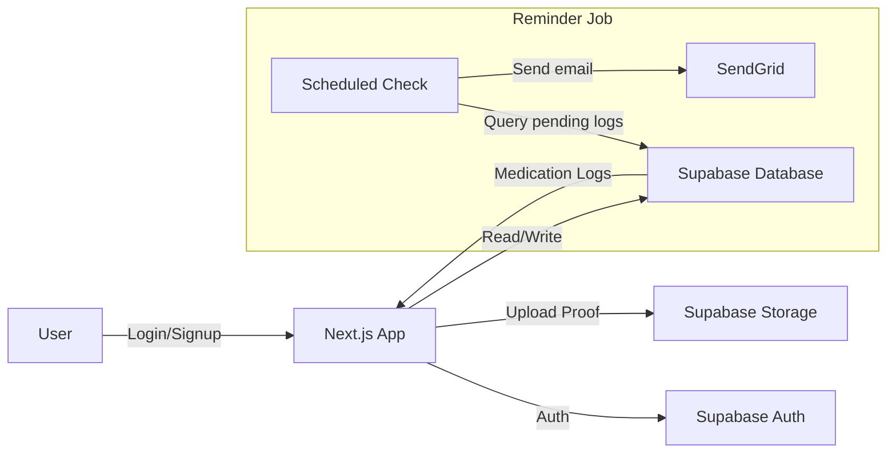

# MedsBuddy

Assignment project: a medication reminder app that helps patients mark daily meds as taken and notifies caretakers if a dose is missed.

## Problem Summary

- Patients mark each medication as taken for today.
- If a medication is not marked within a set time, a reminder email is sent to the caretaker.
- Caretakers can add medications for one patient per account.
- Patient and caretaker share the same login for simplicity.

## Features

- Signup and login with Supabase Auth.
- Add medications with name, dosage, frequency, and time(s).
- View medication list and daily log.
- Mark medication as taken for today.
- Background check for missed doses with email notification.

## Tech Stack

- Next.js (App Router) + TypeScript
- Tailwind CSS and shadcn/ui
- Supabase (Auth, Database, Storage)
- React Query for client state and caching
- React Hook Form + Zod validation
- SendGrid for email delivery

## Project Structure (high level)

- [src/app](src/app) - routes, layouts, and API handlers
- [src/components](src/components) - UI and feature components
- [src/lib](src/lib) - Supabase clients and API helpers
- [src/providers](src/providers) - app providers (React Query, Supabase)
- [supabase](supabase) - Supabase config and functions

## Environment Variables

Create a `.env.local` in the project root:

```
NEXT_PUBLIC_SUPABASE_URL=
NEXT_PUBLIC_SUPABASE_ANON_KEY=
SUPABASE_URL=
SUPABASE_SERVICE_ROLE_KEY=
SENDGRID_API_KEY=
```

## Database Tables

Expected tables (Supabase):

- `medications`
- `medication_logs`
- `users`

## Local Development

Install dependencies:

```
npm install
```

Run the app:

```
npm run dev
```

## Deployment

Deploy to Vercel or Netlify. Set the same environment variables in the hosting dashboard.

## System Diagram



## Evaluation Checklist Mapping

- Code organization: components, lib, and providers are separated.
- Error handling: API routes and client mutations handle failures.
- Type safety: TypeScript types are used throughout (no `any`).
- Reusability: shared UI components and feature modules.
- State management: React Query for server state.
- Performance: cached queries, minimal re-fetching.
- Security: input validation, server-side auth checks, protected routes.

## Assignment Notes

The UI follows the sample behavior but uses a custom design. Patient and caretaker are available under the same account as required.
